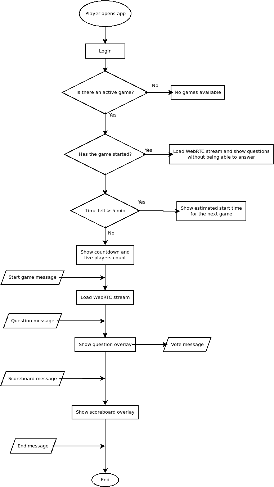

# Preguntitas Game flow.

Here there is a diagram showing Game flow from a client perspective. Interaction before game starts is HTTP based. Once player is in the waiting room for a game to start communications shifts to websocket communication using the protocol described [here](server-client-protocol.md)

